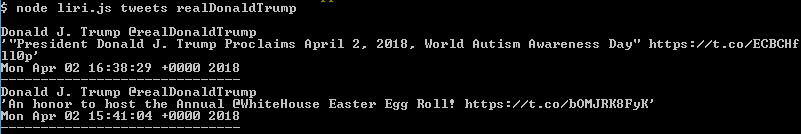
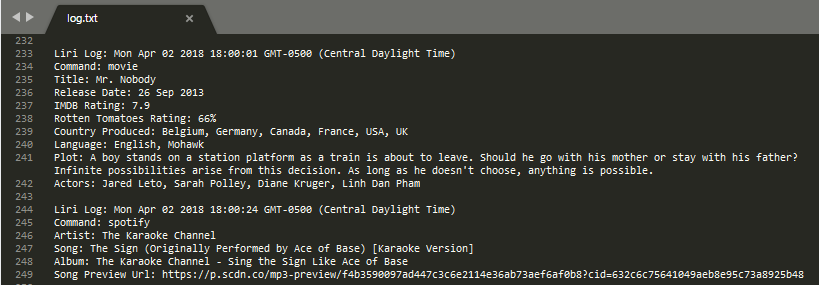

# liri-node-app
Liri is like iPhone's SIRI, however Liri is a *Language* Interpretation and Recognition Interface. Liri is a command line node app that takes in parameters and gives you back data. You can search for details about user tweets, songs, or movies.

## Instructions For Using Liri:
* There are 4 different options that users can do. They can use see tweets, songs, movies, or do multiple of them at the same time.

## Twitter
1. Search for a twitter user's tweets by entering the command `tweets "<user name>"`
2. The latest 20 tweets are shown by the user

## Spotify
1. Search for a song by entering the command `spotify "<song name>"`.
	* Make sure that the song name is in quotes if the song name is more than one word
2. The artist's name, song's name, album that the song belongs to, and a preview url of the song will be shown

## OMDB
1. Search for a movie by entering the command `movie "<movie name>"`
2. The movie's title, release date, rating, country produced, language, plot summary, and actors will be shown

## Multiple Commands
1. Write commands to **random.txt** in the format of `action,"<name>"` and separate commands on different lines. Execute them by entering the command `do-what-it-says`

2. All the commands will be executed in order

## Extras
* The names in quotes are **optional**. If no name is entered, a **default** will be searched for instead

* All user commands are logged into **log.txt**

* If a user enters someth ing other than the commands listed, an error message will be displayed showing what commands you can do

## Technologies Used
* Twitter API
* Spotify API
* OMDB API
* Javascript